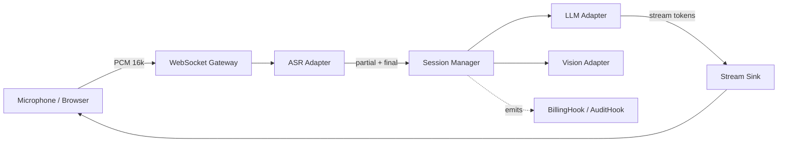

# VoxCore

> The open real-time voice AI engine — **ASR + LLM + Vision** in one stream.

[](LICENSE)
[](pyproject.toml)
[](https://github.com/tianjimeteor/VoxCore/actions/workflows/ci.yml)

[English](README.md) | [简体中文](README.zh-CN.md)

VoxCore is a batteries-included Python framework that turns your microphone into an
AI-native input: **streaming speech recognition, LLM reasoning, and multimodal
vision** — all pluggable, all stream-first, all production-safe by default.

> Built from the ground up for sub-second end-to-end latency.

---

## Why VoxCore?

| Pain point                                      | VoxCore answer                                          |
| ----------------------------------------------- | ------------------------------------------------------- |
| Stitching ASR → LLM → TTS is boring and fragile | One `VoxCore()` facade, decorator-based event handlers  |
| Every provider has a different SDK              | Unified `ASRAdapter` / `LLMAdapter` / `VisionAdapter`   |
| WebSocket + auth + rate-limit is boilerplate    | Ships with JWT auth, per-IP limiter, audit logs         |
| Insecure defaults leak secrets                  | Refuses to start with default `JWT_SECRET_KEY`          |
| Billing, device binding are proprietary         | Pluggable `BillingHook` / `AuditHook` — inject your own |

---

## 60-second demo

```bash
pip install voxcore
voxcore gen-secret > .env
voxcore run --asr whisper --llm openai
```

Open `http://localhost:8000/demo` and start talking.

---

## 20-line "hello voice"

```python
from voxcore import VoxCore, stream

app = VoxCore(asr="xunfei", llm="deepseek")

@app.on_transcript
async def handle(text: str, ctx):
    """Runs every time the user finishes a sentence."""
    async for chunk in stream(ctx.llm.complete(f"Answer briefly: {text}")):
        await ctx.send(chunk)

if __name__ == "__main__":
    app.run(host="0.0.0.0", port=8000)
```

---

## Architecture



---

## Adapters shipped

| Category | Built-in                                     | Planned            |
| -------- | -------------------------------------------- | ------------------ |
| ASR      | Xunfei (讯飞), Whisper (local), Paraformer   | Deepgram, AssemblyAI |
| LLM      | OpenAI-compatible, DeepSeek, SiliconFlow     | Anthropic, Ollama  |
| Vision   | SiliconFlow (GLM-4V / Qwen-VL / DeepSeek-OCR) | Gemini             |

Write your own adapter in **~30 lines** — see [docs/adapters.md](docs/adapters.md).

---

## Security by default

VoxCore refuses insecure configurations:

- Startup aborts if `JWT_SECRET_KEY` is unset or equals the default
- CORS defaults to localhost; production requires explicit `ALLOWED_ORIGINS`
- Passwords: bcrypt with min-length policy
- All writes go through SQLAlchemy parameterized queries
- Built-in per-IP rate limiting (login / register / redeem)
- Audit trail via `AuditHook` — plug into your SIEM
- CI: `gitleaks`, `pip-audit`, `CodeQL` on every PR

See [SECURITY.md](SECURITY.md) for the disclosure policy.

---

## Roadmap

- [x] v0.1 — ASR + LLM streaming, JWT auth, Docker
- [ ] v0.2 — JS SDK (WebRTC direct-to-gateway)
- [ ] v0.3 — Function calling / tool use in `on_transcript`
- [ ] v0.4 — Local-first mode (Whisper.cpp + llama.cpp preset)

---

## Community

- Issues & feature requests: [GitHub Issues](https://github.com/tianjimeteor/VoxCore/issues)
- Discussions: [GitHub Discussions](https://github.com/tianjimeteor/VoxCore/discussions)
- Security: see [SECURITY.md](SECURITY.md)

Contributions welcome — please read [CONTRIBUTING.md](CONTRIBUTING.md) first.

---

## License

[Apache License 2.0](LICENSE) © 2026 VoxCore Authors
