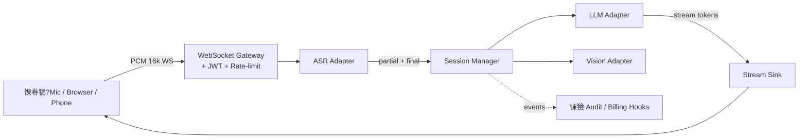

<div align="center">

<!-- 鈺斺晲鈺愨晲鈺愨晲鈺愨晲鈺愨晲鈺愨晲鈺愨晲鈺愨晲鈺愨晲鈺愨晲鈺愨晲鈺愨晲鈺愨晲鈺愨晲鈺愨晲鈺愨晲鈺愨晲鈺愨晲鈺愨晲鈺愨晲鈺愨晲鈺愨晲鈺愨晲鈺愨晲鈺愨晲鈺愨晲鈺愨晲鈺愨晲鈺愨晲鈺愨晲鈺愨晲鈺愨晲鈺愨晲鈺愨晲鈺愨晲鈺愨晽 -->
<!-- 鈺?                          HERO BANNER                                鈺?-->
<!-- 鈺氣晲鈺愨晲鈺愨晲鈺愨晲鈺愨晲鈺愨晲鈺愨晲鈺愨晲鈺愨晲鈺愨晲鈺愨晲鈺愨晲鈺愨晲鈺愨晲鈺愨晲鈺愨晲鈺愨晲鈺愨晲鈺愨晲鈺愨晲鈺愨晲鈺愨晲鈺愨晲鈺愨晲鈺愨晲鈺愨晲鈺愨晲鈺愨晲鈺愨晲鈺愨晲鈺愨晲鈺愨晲鈺愨晲鈺愨晲鈺愨晲鈺愨暆 -->


<!-- Badges -->
<p align="center">
  <a href="https://tianjimeteor.github.io/VoxCore/"></a>
  <a href="https://github.com/tianjimeteor/VoxCore/blob/main/LICENSE"></a>
  <a href="https://github.com/tianjimeteor/VoxCore/actions/workflows/ci.yml"></a>
  <a href="https://www.python.org/downloads/"></a>
  <a href="https://github.com/tianjimeteor/VoxCore/stargazers"></a>
</p>

<h3>
  馃帣锔?Turn any microphone into an AI-native input.
</h3>

<p>
  <b>Sub-second latency</b> 路 <b>Stream-first</b> 路 <b>Pluggable adapters</b> 路 <b>Secure by default</b>
</p>

<!-- Typing animation -->


<br/><br/>

<!-- 鈹€鈹€ Primary badges 鈹€鈹€鈹€鈹€鈹€鈹€鈹€鈹€鈹€鈹€鈹€鈹€鈹€鈹€鈹€鈹€鈹€鈹€鈹€鈹€鈹€鈹€鈹€鈹€鈹€鈹€鈹€鈹€鈹€鈹€鈹€鈹€鈹€鈹€鈹€鈹€鈹€鈹€鈹€鈹€鈹€鈹€鈹€鈹€鈹€鈹€鈹€鈹€鈹€鈹€鈹€ -->
<p>
  <a href="LICENSE"></a>
  <a href="pyproject.toml"></a>
  <a href="https://github.com/tianjimeteor/VoxCore/actions/workflows/ci.yml"></a>
  <a href="https://github.com/tianjimeteor/VoxCore/releases"></a>
</p>

<!-- 鈹€鈹€ Community badges 鈹€鈹€鈹€鈹€鈹€鈹€鈹€鈹€鈹€鈹€鈹€鈹€鈹€鈹€鈹€鈹€鈹€鈹€鈹€鈹€鈹€鈹€鈹€鈹€鈹€鈹€鈹€鈹€鈹€鈹€鈹€鈹€鈹€鈹€鈹€鈹€鈹€鈹€鈹€鈹€鈹€鈹€鈹€鈹€鈹€鈹€鈹€鈹€ -->
<p>
  <a href="https://github.com/tianjimeteor/VoxCore/stargazers"></a>
  <a href="https://github.com/tianjimeteor/VoxCore/network/members"></a>
  <a href="https://github.com/tianjimeteor/VoxCore/issues"></a>
  <a href="https://github.com/tianjimeteor/VoxCore/pulls"></a>
  
  
</p>

<!-- 鈹€鈹€ Tech badges 鈹€鈹€鈹€鈹€鈹€鈹€鈹€鈹€鈹€鈹€鈹€鈹€鈹€鈹€鈹€鈹€鈹€鈹€鈹€鈹€鈹€鈹€鈹€鈹€鈹€鈹€鈹€鈹€鈹€鈹€鈹€鈹€鈹€鈹€鈹€鈹€鈹€鈹€鈹€鈹€鈹€鈹€鈹€鈹€鈹€鈹€鈹€鈹€鈹€鈹€鈹€鈹€鈹€ -->
<p>
  
  
  
  
  
  
  
</p>

<sub><b>馃寪 Language:</b> <a href="README.md">English</a> 路 <a href="README.zh-CN.md">绠€浣撲腑鏂?/a></sub>

</div>

---

## 鉁?Why VoxCore?

<table>
<tr>
<td width="50%">

**Stitching `ASR 鈫?LLM 鈫?TTS` is painful.**
Every provider invents its own SDK, auth, error model. Stream resumption, cold-start latency, backpressure 鈥?you re-implement all of it.

**VoxCore gives you one thing: the pipeline.**
A single `VoxCore()` facade, decorator-based handlers, unified adapters across vendors.

</td>
<td width="50%">

**Insecure defaults get shipped. A lot.**
Wildcard CORS, default JWT secrets, missing rate limits 鈥?most starter projects have at least two.

**VoxCore refuses to start when you have them.**
The process aborts with a clear error. No "TODO fix before prod" comments that never get fixed.

</td>
</tr>
</table>

<div align="center">

| 馃殔 Low-latency | 馃攲 Pluggable | 馃洝锔?Secure | 馃З Extensible | 馃И Typed |
|:--:|:--:|:--:|:--:|:--:|
| Sub-second E2E | ASR / LLM / Vision | Fail-closed defaults | `AuditHook` / `BillingHook` | Strict `mypy` |

</div>

---

## 馃幀 Use Cases

> Designed for latency-sensitive, speech-first products. Pick one and ship fast.

| | Scenario | What VoxCore gives you |
|:--:|:---|:---|
| 馃帳 | **Interview Copilot** | Live transcript + streaming LLM suggestions while the candidate speaks 鈥?used by coaching platforms and hiring panels. |
| 馃摑 | **Meeting Note-taker** | Real-time captions, incremental summary, action-item extraction. Drop-in replacement for paid SaaS recorders. |
| 馃帗 | **Language / Speaking Coach** | Pronunciation feedback + LLM-generated dialogue prompts + vocab reinforcement. |
| 馃摓 | **Voice Customer Service** | Low-latency voicebot that *reasons* instead of walking rigid IVR trees. |
| 鈾?| **Accessibility Assistant** | Captions for the deaf; vision adapter describes the scene for the blind. |
| 馃摵 | **Live-stream Captions** | Stream-first pipeline fits broadcast budget (< 800 ms) without a dedicated caption farm. |
| 馃帶 | **Podcast 鈫?Article** | Long-audio transcription + LLM re-structuring into publishable prose. |
| 馃殫 | **In-car Voice Assistant** | Offline-capable stack (Whisper.cpp preset) for privacy-sensitive edge deployments. |
| 馃彞 | **Clinical Scribe** | Doctor-patient dialogue 鈫?SOAP note draft, with `AuditHook` capturing PHI access. |
| 馃幃 | **Game / VR NPC** | Real-time speech input for AI-driven characters and companions. |

---

## 馃摝 Download Apps

> Don't want to write code? Grab a ready-to-run desktop bundle.

<table>
<tr>
<td width="50%" valign="top">

### 馃幀 [VoxStream](apps/voxstream/) 鈥?OBS / B绔?/ Twitch live captions

Local WebSocket caption server + transparent overlay page for [OBS Browser Source](https://obsproject.com/). 4 themes (streaming / classroom / meeting / minimal), optional live translation.

* **Windows / macOS / Linux** 鈥?[Releases 鈻竇(https://github.com/tianjimeteor/VoxCore/releases?q=voxstream)
* **Try in browser** 鈥?[Hugging Face Space 鈻竇(apps/voxstream/huggingface/)

```bash
pip install -e "apps/voxstream"
voxstream serve --asr echo
# add http://localhost:7860/overlay as a Browser Source in OBS
```

</td>
<td width="50%" valign="top">

### 馃摑 [VoxNote](apps/voxnote/) 鈥?privacy-first meeting notebook

Desktop window (PyWebView + Vue 3) 鈥?record, transcribe, summarize, search. Action items auto-extracted. SQLite + FTS5. 100% local optional with `whisper-local`.

* **Windows installer / macOS dmg / Linux AppImage** 鈥?[Releases 鈻竇(https://github.com/tianjimeteor/VoxCore/releases?q=voxnote)

```bash
pip install -e "apps/voxnote[local]"
python -m voxnote
```

</td>
</tr>
</table>

Both apps are **monorepo siblings** under [`apps/`](apps/) 鈥?they reuse the VoxCore facade and adapter registry, so anything you add to VoxCore (a new ASR, a new LLM) lights up in both products immediately.

---

## 馃殌 60-Second Demo

```bash
pip install voxcore
voxcore gen-secret > .env
voxcore run --asr echo --llm echo      # zero API keys needed
```

Open **http://localhost:8000/docs** 鈥?FastAPI's interactive playground 鈥?or use `examples/web_demo/index.html` to talk to the WebSocket gateway.

---

## 馃И 20-Line "Hello Voice"

```python
from voxcore import VoxCore, stream

app = VoxCore(asr="xunfei", llm="deepseek")

@app.on_transcript
async def handle(text: str, ctx):
    """Runs every time the user finishes a sentence."""
    async for chunk in stream(ctx.llm.complete(f"Answer briefly: {text}")):
        await ctx.send(chunk)

if __name__ == "__main__":
    app.run(host="0.0.0.0", port=8000)
```

That's the whole program. No server boilerplate, no WebSocket plumbing, no auth glue 鈥?it's all in the framework.

---

## 馃彈锔?Architecture



**Three layers**, each with a tiny public contract:

1. **Gateway** 鈥?WebSocket + JWT + rate limit + heartbeat. You don't touch this.
2. **Adapters** 鈥?swap vendors (`xunfei` 鈫?`whisper`, `deepseek` 鈫?`openai`) without editing handlers.
3. **Hooks** 鈥?inject cross-cutting concerns (billing, audit, device binding) without forking the core.

See [docs/architecture.md](docs/architecture.md) for the full lifecycle.

---

## 馃攲 Adapters Shipped

<div align="center">

| Category | Built-in | Planned | Custom? |
|:---|:---|:---|:---|
| 馃帳 **ASR**    | `echo`, `xunfei` (璁), Whisper*, Paraformer* | Deepgram, AssemblyAI | ~30 LoC |
| 馃 **LLM**    | `echo`, OpenAI, DeepSeek, SiliconFlow           | Anthropic, Ollama, Bedrock | ~30 LoC |
| 馃憗锔?**Vision** | SiliconFlow (GLM-4V / Qwen-VL / DeepSeek-OCR)   | Gemini, GPT-4V direct | ~20 LoC |

<sub>* = stub shipped, contributions welcome</sub>

</div>

Write your own adapter in **~30 lines** 鈥?see [docs/adapters.md](docs/adapters.md).

---

## 馃洝锔?Security by Default

VoxCore refuses insecure configurations at **startup**, not at first breach:

- 鉀?Aborts if `JWT_SECRET_KEY` is unset, a known placeholder, or shorter than 32 chars
- 馃敀 CORS defaults to `localhost`; production requires explicit `ALLOWED_ORIGINS`
- 馃 Passwords: `bcrypt` with minimum-length policy
- 馃洟锔?All DB writes go through SQLAlchemy parameterized queries (no string SQL anywhere)
- 馃殾 Built-in per-IP rate limits (login / register / redeem)
- 馃憗锔?Audit trail via `AuditHook` 鈥?pipe to your SIEM
- 馃 CI: `gitleaks` + `pip-audit` + `CodeQL` on every PR
- 馃惓 Docker image runs as a non-root user (uid 1001)

Full threat model: [docs/security.md](docs/security.md) 路 Disclosure policy: [SECURITY.md](SECURITY.md)

---

## 馃椇锔?Roadmap

- [x] **v0.1** 鈥?ASR + LLM streaming, JWT auth, Docker, OpenAI-compatible adapters
- [ ] **v0.2** 鈥?JS SDK (WebRTC direct-to-gateway), TTS streaming out
- [ ] **v0.3** 鈥?Function calling / tool use in `@on_transcript`
- [ ] **v0.4** 鈥?Local-first preset (Whisper.cpp + llama.cpp, no cloud calls)
- [ ] **v0.5** 鈥?Observability pack (OpenTelemetry traces + Prometheus metrics)
- [ ] **v1.0** 鈥?API freeze, semantic versioning, LTS branch

[See the full roadmap & vote on features 鈫抅(https://github.com/tianjimeteor/VoxCore/discussions/categories/ideas)

---

## 鉂わ笍 Contributing

We love adapters, docs, bug reports, and typo fixes equally.

1. Read [CONTRIBUTING.md](CONTRIBUTING.md) (takes 2 minutes)
2. Pick a [`good first issue`](https://github.com/tianjimeteor/VoxCore/issues?q=is%3Aissue+is%3Aopen+label%3A%22good+first+issue%22) or propose your own
3. Sign your commits: `git commit -s` (we use DCO)

<a href="https://github.com/tianjimeteor/VoxCore/graphs/contributors">
  
</a>

---

## 馃挰 Community

- 馃悰 **Bugs**: [GitHub Issues](https://github.com/tianjimeteor/VoxCore/issues/new/choose)
- 馃挕 **Ideas**: [GitHub Discussions](https://github.com/tianjimeteor/VoxCore/discussions)
- 馃攼 **Security**: [Private Vulnerability Report](https://github.com/tianjimeteor/VoxCore/security/advisories/new) (please don't open public issues)

---

## 馃搱 Star History

<a href="https://star-history.com/#tianjimeteor/VoxCore&Date">
  
</a>

---

## 馃摐 License

<p align="center">
  <a href="LICENSE"></a>
</p>

Released under the [Apache License 2.0](LICENSE) 漏 2026 VoxCore Authors.

---

<div align="center">


<b>Made with 鉂わ笍 for the voice-AI community.</b>

If VoxCore saves you time, please consider giving it a 猸?鈥?it really helps.

</div>
