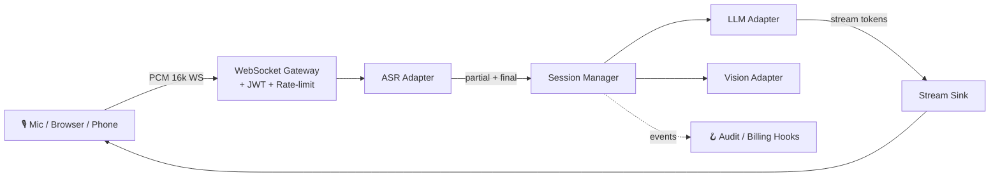

<div align="center">

<!-- ╔══════════════════════════════════════════════════════════════════════╗ -->
<!-- ║                           HERO BANNER                                ║ -->
<!-- ╚══════════════════════════════════════════════════════════════════════╝ -->


<h3>
  🎙️ Turn any microphone into an AI-native input.
</h3>

<p>
  <b>Sub-second latency</b> · <b>Stream-first</b> · <b>Pluggable adapters</b> · <b>Secure by default</b>
</p>

<!-- Typing animation -->


<br/><br/>

<!-- ── Primary badges ─────────────────────────────────────────────────── -->
<p>
  <a href="LICENSE"></a>
  <a href="pyproject.toml"></a>
  <a href="https://github.com/tianjimeteor/VoxCore/actions/workflows/ci.yml"></a>
  <a href="https://github.com/tianjimeteor/VoxCore/releases"></a>
</p>

<!-- ── Community badges ──────────────────────────────────────────────── -->
<p>
  <a href="https://github.com/tianjimeteor/VoxCore/stargazers"></a>
  <a href="https://github.com/tianjimeteor/VoxCore/network/members"></a>
  <a href="https://github.com/tianjimeteor/VoxCore/issues"></a>
  <a href="https://github.com/tianjimeteor/VoxCore/pulls"></a>
  
  
</p>

<!-- ── Tech badges ───────────────────────────────────────────────────── -->
<p>
  
  
  
  
  
  
  
</p>

<sub><b>🌐 Language:</b> <a href="README.md">English</a> · <a href="README.zh-CN.md">简体中文</a></sub>

</div>

---

## ✨ Why VoxCore?

<table>
<tr>
<td width="50%">

**Stitching `ASR → LLM → TTS` is painful.**
Every provider invents its own SDK, auth, error model. Stream resumption, cold-start latency, backpressure — you re-implement all of it.

**VoxCore gives you one thing: the pipeline.**
A single `VoxCore()` facade, decorator-based handlers, unified adapters across vendors.

</td>
<td width="50%">

**Insecure defaults get shipped. A lot.**
Wildcard CORS, default JWT secrets, missing rate limits — most starter projects have at least two.

**VoxCore refuses to start when you have them.**
The process aborts with a clear error. No "TODO fix before prod" comments that never get fixed.

</td>
</tr>
</table>

<div align="center">

| 🚅 Low-latency | 🔌 Pluggable | 🛡️ Secure | 🧩 Extensible | 🧪 Typed |
|:--:|:--:|:--:|:--:|:--:|
| Sub-second E2E | ASR / LLM / Vision | Fail-closed defaults | `AuditHook` / `BillingHook` | Strict `mypy` |

</div>

---

## 🎬 Use Cases

> Designed for latency-sensitive, speech-first products. Pick one and ship fast.

| | Scenario | What VoxCore gives you |
|:--:|:---|:---|
| 🎤 | **Interview Copilot** | Live transcript + streaming LLM suggestions while the candidate speaks — used by coaching platforms and hiring panels. |
| 📝 | **Meeting Note-taker** | Real-time captions, incremental summary, action-item extraction. Drop-in replacement for paid SaaS recorders. |
| 🎓 | **Language / Speaking Coach** | Pronunciation feedback + LLM-generated dialogue prompts + vocab reinforcement. |
| 📞 | **Voice Customer Service** | Low-latency voicebot that *reasons* instead of walking rigid IVR trees. |
| ♿ | **Accessibility Assistant** | Captions for the deaf; vision adapter describes the scene for the blind. |
| 📺 | **Live-stream Captions** | Stream-first pipeline fits broadcast budget (< 800 ms) without a dedicated caption farm. |
| 🎧 | **Podcast → Article** | Long-audio transcription + LLM re-structuring into publishable prose. |
| 🚗 | **In-car Voice Assistant** | Offline-capable stack (Whisper.cpp preset) for privacy-sensitive edge deployments. |
| 🏥 | **Clinical Scribe** | Doctor-patient dialogue → SOAP note draft, with `AuditHook` capturing PHI access. |
| 🎮 | **Game / VR NPC** | Real-time speech input for AI-driven characters and companions. |

---

## 📦 Download Apps

> Don't want to write code? Grab a ready-to-run desktop bundle.

<table>
<tr>
<td width="50%" valign="top">

### 🎬 [VoxStream](apps/voxstream/) — OBS / B站 / Twitch live captions

Local WebSocket caption server + transparent overlay page for [OBS Browser Source](https://obsproject.com/). 4 themes (streaming / classroom / meeting / minimal), optional live translation.

* **Windows / macOS / Linux** — [Releases ▸](https://github.com/tianjimeteor/VoxCore/releases?q=voxstream)
* **Try in browser** — [Hugging Face Space ▸](apps/voxstream/huggingface/)

```bash
pip install -e "apps/voxstream"
voxstream serve --asr echo
# add http://localhost:7860/overlay as a Browser Source in OBS
```

</td>
<td width="50%" valign="top">

### 📝 [VoxNote](apps/voxnote/) — privacy-first meeting notebook

Desktop window (PyWebView + Vue 3) — record, transcribe, summarize, search. Action items auto-extracted. SQLite + FTS5. 100% local optional with `whisper-local`.

* **Windows installer / macOS dmg / Linux AppImage** — [Releases ▸](https://github.com/tianjimeteor/VoxCore/releases?q=voxnote)

```bash
pip install -e "apps/voxnote[local]"
python -m voxnote
```

</td>
</tr>
</table>

Both apps are **monorepo siblings** under [`apps/`](apps/) — they reuse the VoxCore facade and adapter registry, so anything you add to VoxCore (a new ASR, a new LLM) lights up in both products immediately.

---

## 🚀 60-Second Demo

```bash
pip install voxcore
voxcore gen-secret > .env
voxcore run --asr echo --llm echo      # zero API keys needed
```

Open **http://localhost:8000/docs** — FastAPI's interactive playground — or use `examples/web_demo/index.html` to talk to the WebSocket gateway.

---

## 🧪 20-Line "Hello Voice"

```python
from voxcore import VoxCore, stream

app = VoxCore(asr="xunfei", llm="deepseek")

@app.on_transcript
async def handle(text: str, ctx):
    """Runs every time the user finishes a sentence."""
    async for chunk in stream(ctx.llm.complete(f"Answer briefly: {text}")):
        await ctx.send(chunk)

if __name__ == "__main__":
    app.run(host="0.0.0.0", port=8000)
```

That's the whole program. No server boilerplate, no WebSocket plumbing, no auth glue — it's all in the framework.

---

## 🏗️ Architecture



**Three layers**, each with a tiny public contract:

1. **Gateway** — WebSocket + JWT + rate limit + heartbeat. You don't touch this.
2. **Adapters** — swap vendors (`xunfei` → `whisper`, `deepseek` → `openai`) without editing handlers.
3. **Hooks** — inject cross-cutting concerns (billing, audit, device binding) without forking the core.

See [docs/architecture.md](docs/architecture.md) for the full lifecycle.

---

## 🔌 Adapters Shipped

<div align="center">

| Category | Built-in | Planned | Custom? |
|:---|:---|:---|:---|
| 🎤 **ASR**    | `echo`, `xunfei` (讯飞), Whisper*, Paraformer* | Deepgram, AssemblyAI | ~30 LoC |
| 🧠 **LLM**    | `echo`, OpenAI, DeepSeek, SiliconFlow           | Anthropic, Ollama, Bedrock | ~30 LoC |
| 👁️ **Vision** | SiliconFlow (GLM-4V / Qwen-VL / DeepSeek-OCR)   | Gemini, GPT-4V direct | ~20 LoC |

<sub>* = stub shipped, contributions welcome</sub>

</div>

Write your own adapter in **~30 lines** — see [docs/adapters.md](docs/adapters.md).

---

## 🛡️ Security by Default

VoxCore refuses insecure configurations at **startup**, not at first breach:

- ⛔ Aborts if `JWT_SECRET_KEY` is unset, a known placeholder, or shorter than 32 chars
- 🔒 CORS defaults to `localhost`; production requires explicit `ALLOWED_ORIGINS`
- 🧂 Passwords: `bcrypt` with minimum-length policy
- 🛢️ All DB writes go through SQLAlchemy parameterized queries (no string SQL anywhere)
- 🚦 Built-in per-IP rate limits (login / register / redeem)
- 👁️ Audit trail via `AuditHook` — pipe to your SIEM
- 🤖 CI: `gitleaks` + `pip-audit` + `CodeQL` on every PR
- 🐳 Docker image runs as a non-root user (uid 1001)

Full threat model: [docs/security.md](docs/security.md) · Disclosure policy: [SECURITY.md](SECURITY.md)

---

## 🗺️ Roadmap

- [x] **v0.1** — ASR + LLM streaming, JWT auth, Docker, OpenAI-compatible adapters
- [ ] **v0.2** — JS SDK (WebRTC direct-to-gateway), TTS streaming out
- [ ] **v0.3** — Function calling / tool use in `@on_transcript`
- [ ] **v0.4** — Local-first preset (Whisper.cpp + llama.cpp, no cloud calls)
- [ ] **v0.5** — Observability pack (OpenTelemetry traces + Prometheus metrics)
- [ ] **v1.0** — API freeze, semantic versioning, LTS branch

[See the full roadmap & vote on features →](https://github.com/tianjimeteor/VoxCore/discussions/categories/ideas)

---

## ❤️ Contributing

We love adapters, docs, bug reports, and typo fixes equally.

1. Read [CONTRIBUTING.md](CONTRIBUTING.md) (takes 2 minutes)
2. Pick a [`good first issue`](https://github.com/tianjimeteor/VoxCore/issues?q=is%3Aissue+is%3Aopen+label%3A%22good+first+issue%22) or propose your own
3. Sign your commits: `git commit -s` (we use DCO)

<a href="https://github.com/tianjimeteor/VoxCore/graphs/contributors">
  
</a>

---

## 💬 Community

- 🐛 **Bugs**: [GitHub Issues](https://github.com/tianjimeteor/VoxCore/issues/new/choose)
- 💡 **Ideas**: [GitHub Discussions](https://github.com/tianjimeteor/VoxCore/discussions)
- 🔐 **Security**: [Private Vulnerability Report](https://github.com/tianjimeteor/VoxCore/security/advisories/new) (please don't open public issues)

---

## 📈 Star History

<a href="https://star-history.com/#tianjimeteor/VoxCore&Date">
  
</a>

---

## 📜 License

<p align="center">
  <a href="LICENSE"></a>
</p>

Released under the [Apache License 2.0](LICENSE) © 2026 VoxCore Authors.

---

<div align="center">


<b>Made with ❤️ for the voice-AI community.</b>

If VoxCore saves you time, please consider giving it a ⭐ — it really helps.

</div>
