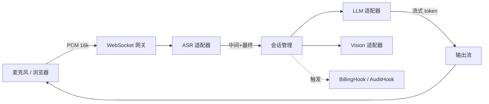

# VoxCore

> 开源的实时语音 AI 引擎 —— **ASR + LLM + Vision**，一套流式管线搞定。

[](LICENSE)
[](pyproject.toml)

[English](README.md) | [简体中文](README.zh-CN.md)

VoxCore 是一个开箱即用的 Python 框架，把麦克风变成 AI 原生的输入：
**流式语音识别、LLM 推理、多模态视觉** —— 适配器可插拔、全链路流式、默认配置生产级安全。

> 为端到端亚秒级延迟而设计。

---

## 为什么选 VoxCore？

| 痛点                         | VoxCore 的方案                                  |
| ---------------------------- | ----------------------------------------------- |
| ASR → LLM → TTS 串联繁琐易错 | 一个 `VoxCore()` Facade，装饰器驱动事件回调    |
| 各家 SDK 接口五花八门        | 统一 `ASRAdapter` / `LLMAdapter` / `VisionAdapter` |
| WebSocket + 鉴权 + 限流要自己写 | 自带 JWT 鉴权、IP 限流、审计日志                |
| 默认配置易泄露密钥           | 使用默认 `JWT_SECRET_KEY` 直接拒绝启动          |
| 计费 / 设备绑定难以定制      | `BillingHook` / `AuditHook` 可插拔，自己注入    |

---

## 60 秒体验

```bash
pip install voxcore
voxcore gen-secret > .env
voxcore run --asr whisper --llm openai
```

打开 `http://localhost:8000/demo` 即可开始说话。

---

## 20 行代码跑起来

```python
from voxcore import VoxCore, stream

app = VoxCore(asr="xunfei", llm="deepseek")

@app.on_transcript
async def handle(text: str, ctx):
    """每当用户说完一句话就触发"""
    async for chunk in stream(ctx.llm.complete(f"简短回答：{text}")):
        await ctx.send(chunk)

if __name__ == "__main__":
    app.run(host="0.0.0.0", port=8000)
```

---

## 架构



---

## 已支持的适配器

| 类型   | 内置                                           | 规划中                |
| ------ | ---------------------------------------------- | --------------------- |
| ASR    | 讯飞、Whisper（本地）、Paraformer              | Deepgram、AssemblyAI  |
| LLM    | OpenAI 兼容、DeepSeek、硅基流动                | Anthropic、Ollama     |
| Vision | 硅基流动（GLM-4V / Qwen-VL / DeepSeek-OCR）    | Gemini                |

写一个自己的适配器只要约 30 行 —— 见 [docs/adapters.md](docs/adapters.md)。

---

## 默认安全

VoxCore 拒绝不安全的配置：

- `JWT_SECRET_KEY` 未设置或使用默认值时直接拒绝启动
- CORS 默认仅允许 localhost，生产需显式配置 `ALLOWED_ORIGINS`
- 密码策略：bcrypt + 最小长度
- 所有写操作走 SQLAlchemy 参数化查询
- 内置按 IP 限流（登录 / 注册 / 兑换）
- `AuditHook` 审计日志，可接入你的 SIEM
- CI：每个 PR 都跑 `gitleaks`、`pip-audit`、`CodeQL`

漏洞披露策略见 [SECURITY.md](SECURITY.md)。

---

## 路线图

- [x] v0.1 — ASR + LLM 流式、JWT 鉴权、Docker
- [ ] v0.2 — JS SDK（WebRTC 直连网关）
- [ ] v0.3 — `on_transcript` 支持 function calling / tool use
- [ ] v0.4 — 完全本地化模式（Whisper.cpp + llama.cpp 预设）

---

## 社区

- Issue 与功能建议：[GitHub Issues](https://github.com/tianjimeteor/VoxCore/issues)
- 讨论区：[GitHub Discussions](https://github.com/tianjimeteor/VoxCore/discussions)
- 安全问题：见 [SECURITY.md](SECURITY.md)

欢迎贡献，提 PR 前请先读 [CONTRIBUTING.md](CONTRIBUTING.md)。

---

## 许可证

[Apache License 2.0](LICENSE) © 2026 VoxCore Authors
