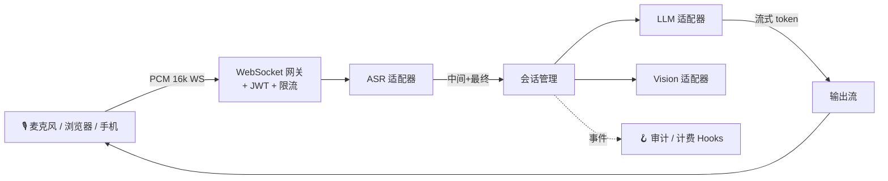

<div align="center">

<!-- ╔══════════════════════════════════════════════════════════════════════╗ -->
<!-- ║                           主横幅                                      ║ -->
<!-- ╚══════════════════════════════════════════════════════════════════════╝ -->


<h3>
  🎙️ 把麦克风变成 AI 原生的输入。
</h3>

<p>
  <b>亚秒级延迟</b> · <b>全链路流式</b> · <b>适配器可插拔</b> · <b>默认安全</b>
</p>

<!-- 打字机动画 -->


<br/><br/>

<!-- ── 主徽章 ─────────────────────────────────────────────────────────── -->
<p>
  <a href="LICENSE"></a>
  <a href="pyproject.toml"></a>
  <a href="https://github.com/tianjimeteor/VoxCore/actions/workflows/ci.yml"></a>
  <a href="https://github.com/tianjimeteor/VoxCore/releases"></a>
</p>

<!-- ── 社区徽章 ──────────────────────────────────────────────────────── -->
<p>
  <a href="https://github.com/tianjimeteor/VoxCore/stargazers"></a>
  <a href="https://github.com/tianjimeteor/VoxCore/network/members"></a>
  <a href="https://github.com/tianjimeteor/VoxCore/issues"></a>
  <a href="https://github.com/tianjimeteor/VoxCore/pulls"></a>
  
  
</p>

<!-- ── 技术栈徽章 ────────────────────────────────────────────────────── -->
<p>
  
  
  
  
  
  
  
</p>

<sub><b>🌐 语言:</b> <a href="README.md">English</a> · <a href="README.zh-CN.md">简体中文</a></sub>

</div>

---

## ✨ 为什么选 VoxCore？

<table>
<tr>
<td width="50%">

**把 `ASR → LLM → TTS` 串起来是件痛苦的事。**
每家供应商有自己的 SDK、鉴权、错误模型；流恢复、冷启动延迟、背压——你要把每件事都再实现一遍。

**VoxCore 只做一件事：管线本身。**
一个 `VoxCore()` Facade、装饰器驱动的事件回调、跨厂商统一的适配器契约。

</td>
<td width="50%">

**不安全的默认配置被大量带上线。**
通配符 CORS、默认 JWT 密钥、没有限流——大多数"starter 项目"至少犯其中两条。

**VoxCore 检测到就拒绝启动。**
进程直接终止并给出明确错误信息，而不是留一句"TODO 上线前修复"永远没人修。

</td>
</tr>
</table>

<div align="center">

| 🚅 低延迟 | 🔌 可插拔 | 🛡️ 安全默认 | 🧩 可扩展 | 🧪 强类型 |
|:--:|:--:|:--:|:--:|:--:|
| 端到端亚秒级 | ASR / LLM / Vision | 失败时拒绝启动 | `AuditHook` / `BillingHook` | 严格 `mypy` |

</div>

---

## 🎬 使用场景

> 面向延迟敏感、语音优先的产品。选一个赛道，快速落地。

| | 场景 | VoxCore 给你什么 |
|:--:|:---|:---|
| 🎤 | **面试 Copilot** | 候选人开口的同时，实时转写 + 流式 LLM 建议。已被面试辅导平台、招聘方使用。 |
| 📝 | **会议纪要助手** | 实时字幕、增量摘要、行动项抽取。替换付费 SaaS 录音工具。 |
| 🎓 | **语言 / 口语教练** | 发音评估 + LLM 生成对话 prompt + 词汇强化。 |
| 📞 | **语音客服** | 不再是僵硬的 IVR 分支，而是能"推理"的低延迟语音客服机器人。 |
| ♿ | **无障碍辅助** | 听障字幕 + 视障场景描述（Vision adapter）。 |
| 📺 | **直播实时字幕** | 全流式管线匹配直播延迟预算（< 800ms），无需专门的字幕服务器农场。 |
| 🎧 | **播客 → 长文** | 长音频转写 + LLM 结构化为可发表文稿。 |
| 🚗 | **车载语音助手** | 本地优先方案（Whisper.cpp 预设），适合隐私敏感的边缘部署。 |
| 🏥 | **医疗问诊记录** | 医患对话 → SOAP 病历草稿，`AuditHook` 记录 PHI 访问轨迹。 |
| 🎮 | **游戏 / VR NPC** | 给 AI 驱动的 NPC/伙伴加实时语音输入。 |

---

## 🚀 60 秒体验

```bash
pip install voxcore
voxcore gen-secret > .env
voxcore run --asr echo --llm echo      # 零 API key 就能跑
```

打开 **http://localhost:8000/docs** —— FastAPI 的交互式文档；或用 `examples/web_demo/index.html` 通过 WebSocket 与网关对话。

---

## 🧪 20 行代码跑起来

```python
from voxcore import VoxCore, stream

app = VoxCore(asr="xunfei", llm="deepseek")

@app.on_transcript
async def handle(text: str, ctx):
    """每当用户说完一句话就触发"""
    async for chunk in stream(ctx.llm.complete(f"简短回答：{text}")):
        await ctx.send(chunk)

if __name__ == "__main__":
    app.run(host="0.0.0.0", port=8000)
```

就这些。没有服务器样板、没有 WebSocket 管道、没有鉴权胶水——框架里都有了。

---

## 🏗️ 架构



**三层**，每层只有很小的公开契约：

1. **网关** —— WebSocket + JWT + 限流 + 心跳，你不用碰。
2. **适配器** —— 切换厂商（`xunfei` → `whisper`、`deepseek` → `openai`）无需改回调逻辑。
3. **Hooks** —— 注入横切关注点（计费、审计、设备绑定），不用 fork 核心。

完整生命周期见 [docs/architecture.md](docs/architecture.md)。

---

## 🔌 已支持的适配器

<div align="center">

| 类别 | 内置 | 规划中 | 自定义？ |
|:---|:---|:---|:---|
| 🎤 **ASR**    | `echo`、`xunfei`（讯飞）、Whisper*、Paraformer* | Deepgram、AssemblyAI  | 约 30 行 |
| 🧠 **LLM**    | `echo`、OpenAI、DeepSeek、硅基流动             | Anthropic、Ollama、Bedrock | 约 30 行 |
| 👁️ **Vision** | 硅基流动（GLM-4V / Qwen-VL / DeepSeek-OCR）    | Gemini、GPT-4V 直连   | 约 20 行 |

<sub>* = 已提供占位类，欢迎贡献实现</sub>

</div>

写一个自己的适配器只要 **30 行** —— 见 [docs/adapters.md](docs/adapters.md)。

---

## 🛡️ 默认安全

VoxCore 在**启动时**（而不是首次被攻击时）拒绝不安全的配置：

- ⛔ `JWT_SECRET_KEY` 未设置、是已知占位符、或短于 32 字符时直接终止进程
- 🔒 CORS 默认仅允许 localhost；生产必须显式配置 `ALLOWED_ORIGINS`
- 🧂 密码策略：`bcrypt` + 最小长度
- 🛢️ 所有写操作都走 SQLAlchemy 参数化查询（代码库里没有任何拼接 SQL）
- 🚦 内置按 IP 限流（登录 / 注册 / 兑换）
- 👁️ `AuditHook` 审计日志，可接入你的 SIEM
- 🤖 CI：每个 PR 都跑 `gitleaks` + `pip-audit` + `CodeQL`
- 🐳 Docker 镜像以非 root 用户（uid 1001）运行

威胁模型：[docs/security.md](docs/security.md) · 漏洞披露：[SECURITY.md](SECURITY.md)

---

## 🗺️ 路线图

- [x] **v0.1** —— ASR + LLM 流式、JWT 鉴权、Docker、OpenAI 兼容适配器
- [ ] **v0.2** —— JS SDK（WebRTC 直连网关）、TTS 流式输出
- [ ] **v0.3** —— `@on_transcript` 支持 function calling / tool use
- [ ] **v0.4** —— 完全本地化预设（Whisper.cpp + llama.cpp，无云调用）
- [ ] **v0.5** —— 可观测性套件（OpenTelemetry trace + Prometheus metrics）
- [ ] **v1.0** —— API 冻结、语义化版本、LTS 分支

[完整路线图并投票 →](https://github.com/tianjimeteor/VoxCore/discussions/categories/ideas)

---

## ❤️ 贡献

适配器、文档、bug 报告、错别字修复——同样欢迎。

1. 读一下 [CONTRIBUTING.md](CONTRIBUTING.md)（只要 2 分钟）
2. 挑一个 [`good first issue`](https://github.com/tianjimeteor/VoxCore/issues?q=is%3Aissue+is%3Aopen+label%3A%22good+first+issue%22) 或自己提议一个
3. 提交时签名：`git commit -s`（我们使用 DCO）

<a href="https://github.com/tianjimeteor/VoxCore/graphs/contributors">
  
</a>

---

## 💬 社区

- 🐛 **Bug 反馈**：[GitHub Issues](https://github.com/tianjimeteor/VoxCore/issues/new/choose)
- 💡 **想法建议**：[GitHub Discussions](https://github.com/tianjimeteor/VoxCore/discussions)
- 🔐 **安全问题**：[私密漏洞报告](https://github.com/tianjimeteor/VoxCore/security/advisories/new)（请勿在 public issue 中讨论）

---

## 📈 Star 趋势

<a href="https://star-history.com/#tianjimeteor/VoxCore&Date">
  
</a>

---

## 📜 许可证

<p align="center">
  <a href="LICENSE"></a>
</p>

基于 [Apache License 2.0](LICENSE) 发布 © 2026 VoxCore Authors.

---

<div align="center">


<b>Made with ❤️ for the voice-AI community.</b>

如果 VoxCore 为你节省了时间，欢迎点一个 ⭐ —— 对我们真的有帮助。

</div>
