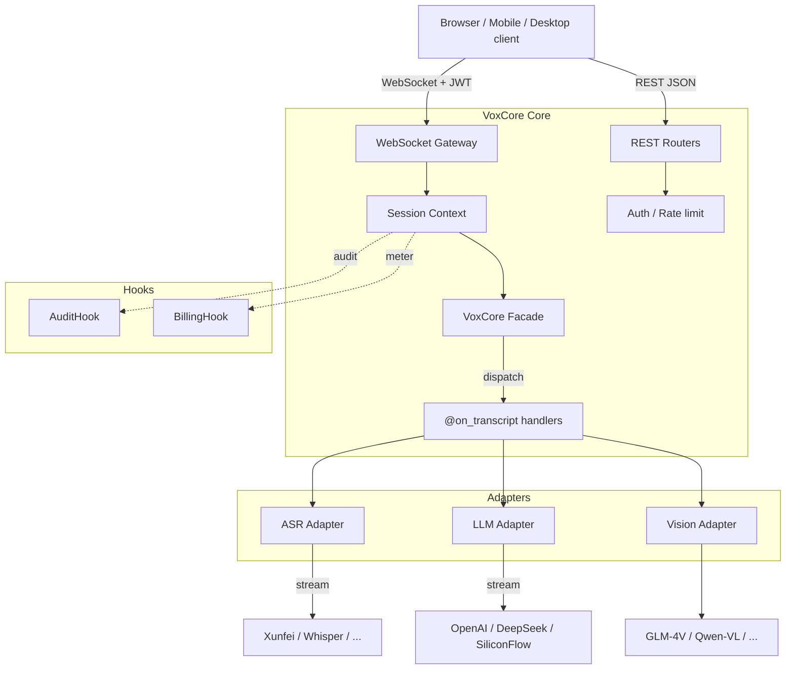

# Architecture

## Request lifecycle (WebSocket)

1. Client connects to `wss://.../ws?token=<JWT>`.
2. Gateway validates the token, creates a `SessionContext`, starts the ASR pump.
3. Client sends `{"type": "audio", "data": "<base64 PCM16 16k>"}` chunks.
4. ASR adapter consumes the audio stream, emits partial + final `Transcript`s.
5. On each final transcript, `VoxCore.dispatch_transcript()` runs every registered
   `@on_transcript` handler. Exceptions are logged but never crash the gateway.
6. Handlers call `ctx.llm.complete(...)`, stream chunks back via `ctx.send()`.

## Why a facade + hooks?

VoxCore's opinions:

- **Adapters** are for swapping *vendors* (OpenAI vs DeepSeek). They should stay
  vendor-neutral and single-responsibility.
- **Hooks** are for injecting *cross-cutting concerns* that the open-source core
  has no opinion about (billing, device binding, SIEM export). Downstream
  products subclass `BillingHook` / `AuditHook` and pass an instance to
  `VoxCore(billing_hook=..., audit_hook=...)`.

This split keeps the open-source contract small (adapters are public API, hooks
are extension points) and lets downstream projects layer their own business
logic on top without forking.

## What lives in downstream / private layers

By design, VoxCore stays out of the following — implement them in your own
layer via the hook surface:

- **Redemption codes / billing records** — store in your own tables; call
  `BillingHook.record_usage()` from your `@on_transcript` handler.
- **Multi-device binding** — inspect client metadata in `AuditHook.emit()` and
  reject follow-up sessions as you see fit.
- **Per-minute quota enforcement** — `BillingHook.can_consume()` is the single
  integration point; return `False` to block.
- **Polished desktop / mobile clients** — keep them in separate repos; they
  speak the same public WebSocket / REST contract.
